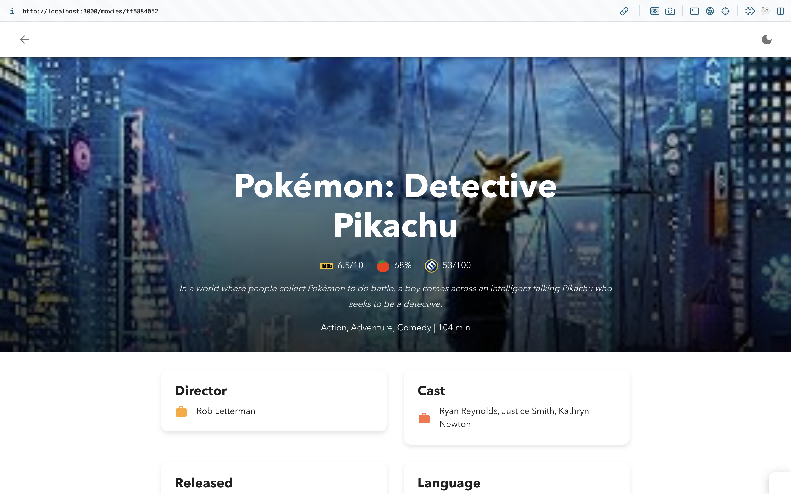
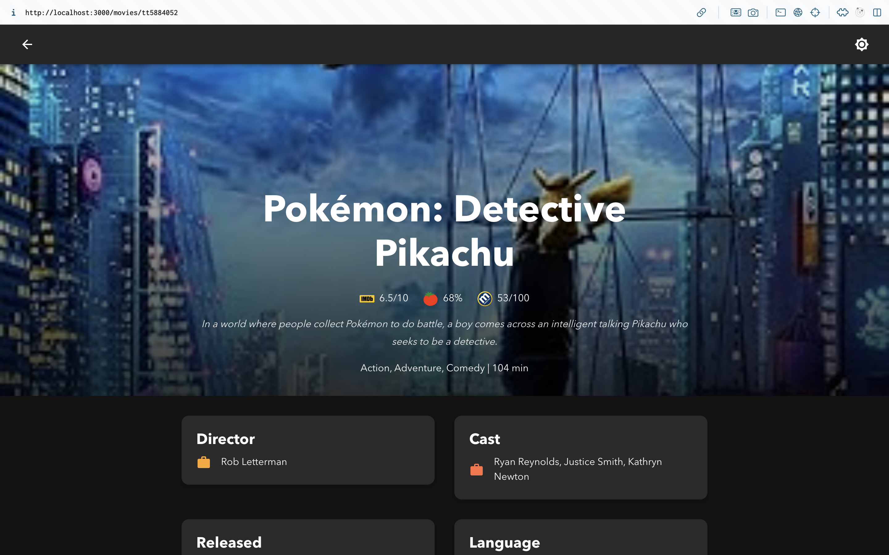

# Movie Lens

This project is a **Single Page Application (SPA)** built with **Next.js**, **React**, and **Material-UI**, allowing users to search for movies, view movie details, and explore ratings from sources like IMDb, Rotten Tomatoes, and Metacritic. The app demonstrates responsive design principles and modern frontend practices, with a focus on a clean and structured layout.

## Features

- **Movie Search**: Users can search for movies, TV shows, and episodes by name.
- **Movie Details Page**: Detailed information about each movie is displayed, including ratings from IMDb, Rotten Tomatoes, and Metacritic.
- **Responsive Design**: The application is fully responsive and adapts well to mobile devices, tablets, and desktop screens.
- **Dark Mode**: Includes support for both light and dark modes, with a theme switcher in the UI.
- **Dynamic Routing**: Dynamic routes are used to navigate to individual movie detail pages.

## Tech Stack

- **Next.js**: Framework used for server-side rendering and routing.
- **React**: Core library used for building the UI components.
- **Material-UI (MUI)**: Component library used for responsive, accessible, and elegant design.
- **Redux**: Used for state management, handling search filters, movie details, and user preferences (like theme mode).
- **Fetch API**: Used to fetch data from the OMDB API.
- **Redux-Persist**: Used to persist the Redux store, retaining search state across sessions.

## Installation and Setup

### Prerequisites

Make sure you have the following installed:

- **Node.js** (version 14.x or above)
- **npm** or **yarn**

### Getting Started

1. **Clone the Repository**:

```bash
git clone https://github.com/fatihcandev/invent-analytics-frontend-case.git
cd invent-analytics-frontend-case
```

2. **Install Dependencies**:

```bash
# Using npm
npm install

# Or using yarn
yarn install
```

3. **Set Up Environment Variables**:

Create a `.env.local` file at the root of the project and add your **OMDB API key**:

```
NEXT_PUBLIC_API_KEY=your_omdb_api_key
```

> You can get an OMDB API key by registering at [OMDB API](https://www.omdbapi.com/apikey.aspx).

4. **Run the Development Server**:

```bash
# Using npm
npm run dev

# Or using yarn
yarn dev
```

Open [http://localhost:3000](http://localhost:3000) to view the app in your browser.

## Folder Structure

```
├── .next                 # Build output directory
├── app                   # Next.js app directory
│   ├── assets            # Assets like images, logos, and fonts
│   │   ├── fonts         # Custom fonts used in the app
│   │   │   ├── AvenirNextLTPro-Bold.otf      # Bold font variant
│   │   │   ├── AvenirNextLTPro-MediumCn.otf  # Medium Condensed font variant
│   │   │   ├── AvenirNextLTPro-Regular.otf   # Regular font variant
│   │   ├── imdb-logo.png                     # IMDb logo for ratings
│   │   ├── metacritic-logo.png               # Metacritic logo for ratings
│   │   └── rotten-tomates-logo.png           # Rotten Tomatoes logo for ratings
│   ├── components        # Reusable UI components
│   │   ├── MovieCard.tsx # Movie card component
│   │   ├── ThemeProvider.tsx # Theme provider for managing light/dark modes
│   │   ├── ThemeSwitch.tsx   # Switch to toggle between light and dark mode
│   │   └── index.ts      # Component index for easy imports
│   ├── movies            # Movie-related pages
│   │   └── [imdbId]      # Dynamic routing folder for individual movie pages
│   │       └── page.tsx  # Movie detail page
│   ├── providers         # Context or providers used throughout the app
│   │   └── index.tsx     # Providers wrapper
│   ├── redux             # Redux store and related files
│   │   ├── hooks         # Custom hooks for Redux actions
│   │   │   ├── useAppActions.ts          # Actions for app state
│   │   │   ├── useMovieDetailsActions.ts # Actions for movie details
│   │   │   └── useThemeActions.ts        # Actions for theme mode
│   │   ├── slices        # Redux slices for managing different states
│   │   │   ├── appSlice.ts               # Slice for app state
│   │   │   ├── movieDetailsSlice.ts      # Slice for movie details
│   │   │   ├── themeSlice.ts             # Slice for theme mode
│   │   └── store.ts      # Redux store configuration
│   ├── utils             # Utility functions
│   │   ├── getApiUrl.ts          # Function to get API URLs
│   │   ├── getMovieDetails.ts    # Fetch movie details from OMDB API
│   │   ├── index.ts              # Utility index
│   │   └── searchMovies.ts       # Fetch movie search results
├── favicon.ico           # Favicon for the website
├── globals.css           # Global CSS styles
├── layout.tsx            # Layout component for shared structure
├── page.tsx              # Main page (home page)
├── types.ts              # TypeScript types used in the app
├── node_modules          # Node.js modules
├── .env.local            # Environment variables file
├── .eslintrc.json        # ESLint configuration
├── .gitignore            # Files and folders to be ignored by git
├── .prettierignore       # Files to be ignored by Prettier
├── .prettierrc           # Prettier configuration
├── next-env.d.ts         # TypeScript definition file for Next.js
├── next.config.mjs       # Next.js configuration file
├── package-lock.json     # Lockfile for npm dependencies
├── package.json          # Project dependencies and scripts
├── README.md             # Project documentation
└── tsconfig.json         # TypeScript configuration
```

## Screenshots




